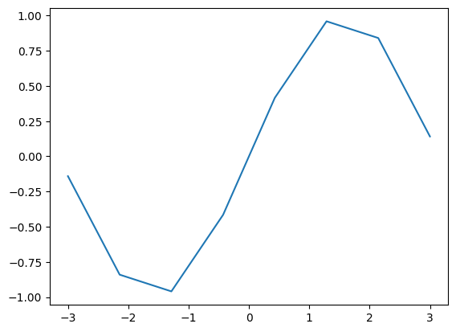
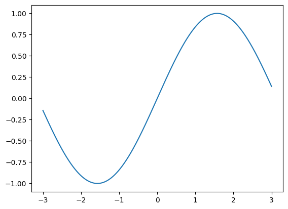
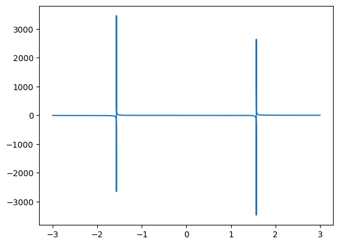
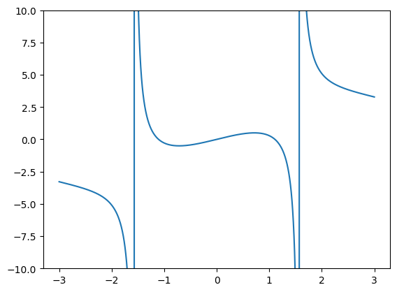
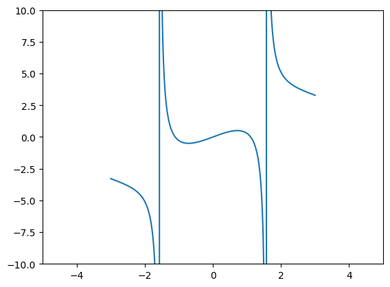
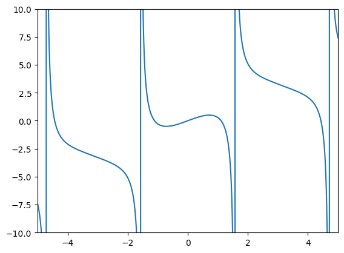

# Python plotting guide

- [Python plotting guide](#python-plotting-guide)
  - [Initialization commando](#initialization-commando)
    - [Tilføj flere variabler](#tilføj-flere-variabler)
  - [2D-plotting](#2d-plotting)
    - [Eksempel](#eksempel)
    - [Detalje-niveau](#detalje-niveau)
    - [Begræns akser](#begræns-akser)
    - [Labels](#labels)

## Initialization commando

```python
def restart():
    # Import packages
    global plt, sp, np, i, pi, e
    import matplotlib.pyplot as plt
    import sympy as sp
    import numpy as np
    
    # Luk pyplot figurer
    plt.close("all")
    plt.rcdefaults()
    
    # Pæn printing
    sp.init_printing()
    
    i, pi, e = sp.I, sp.pi, sp.E
```

Definer en restart kommando. Kør den en gang i starten af dokumentet med `restart()`, og så igen hver gang du vil slette tidligere variabler mm. ligesom i Maple.


### Tilføj flere variabler

```Python
x, y = sp.symbols("x y", real=True) # Reele variabler
z1, z2, z3 = sp.symbols("z1 z2 z3") # Komplekse variabler
```

## 2D-plotting

### Eksempel

Givet en funktion `f = x**2 + 5` kan vi simpelt plotte den ved:

```Python
X = np.linspace(-2, 4, 400)
# Giver en graf der går fra -2 til 4 i x-aksen
# Grafen vil have 400 punkter over x-aksen, flere punkter giver højere detalje
f = x**2 + 5

plt.plot(x, f)
plt.show()

```

### Detalje-niveau

Sinus kurve med 8 punkter:

```Python
x = np.linspace(-3, 3, 8)
f = np.sin(x)

plt.plot(x, f)
plt.show()
```



```Python
x = np.linspace(-3, 3, 800)
f = np.sin(x)

plt.plot(x, f)
plt.show()
```

Sinus kurve med 800 punkter:


På nogle grafer, især høj-frekvens data eller med asymptoter, kan en meget høj sampling rate være nødvendig for at vise grafen akkurat, men oftest er en værdi på $\approx 400$ være fint.

### Begræns akser

En graf som denne fortæller ikke særligt meget:

```Python
x = np.linspace(-3, 3, 9000)
f = np.sin(x) + x**2/x - np.tan(x)

plt.plot(x, f)
plt.show()
```



Ved at tilføje `plt.ylim(-10,10)` kan vi begrænse y-aksen

```Python
x = np.linspace(-3, 3, 9000)
f = np.sin(x) + x**2/x - np.tan(x)

plt.ylim(-10,10)

plt.plot(x, f)
plt.show()
```



Der er også en tilsvarende `plt.xlim(start, slut)` kommando.

Bemærk! Hvis du har defineret en akse som en `np.linspace` giver det ikke mening at gøre `lim` større end den, da der ikke vil være plottet noget der.

```Python
x = np.linspace(-3, 3, 9000)
f = np.sin(x) + x**2/x - np.tan(x)

plt.ylim(-10,10)
plt.xlim(-5,5)

plt.plot(x, f)
plt.show()
```



Ved at gøre `np.linspace` større kan vi fikse det

```Python
start_x = -5
stop_x = 5

x = np.linspace(start_x, stop_x, 9000)
f = np.sin(x) + x**2/x - np.tan(x)

plt.ylim(-10,10)
plt.xlim(start_x,stop_x)

plt.plot(x, f)
plt.show()
```



Når du bruger samme værdi flere steder giver det god mening at skifte det til en variable som vist her, så de altid vil ændres sammen

### Labels
